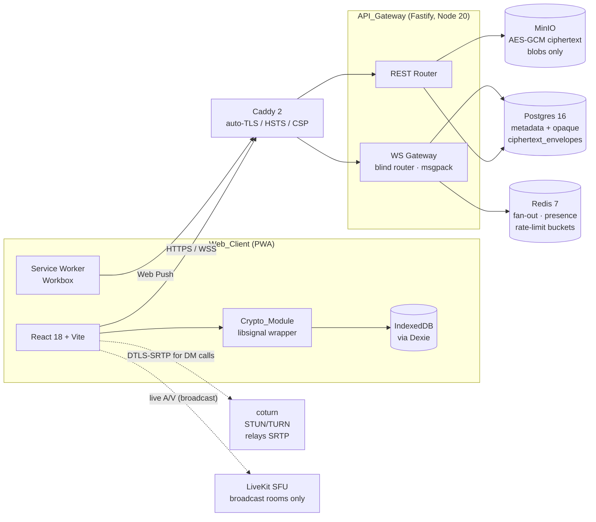

# Konvo

Self-hosted, web-first PWA for real-time conversation. Two distinct modes:
end-to-end encrypted 1:1 direct messages (text, voice notes, file/image
attachments, audio + video calls) and Telegram-style public broadcast rooms
(Ed25519-signed plaintext posts plus optional live A/V via LiveKit). DMs run
on libsignal under the hood — X3DH for session establishment, Double Ratchet
for per-message encryption — over a Fastify gateway engineered as a blind
router that stores opaque ciphertext envelopes and never holds plaintext.

> **Status.** Active build. Developer-facing documentation lives in
> [`docs/`](./docs/) — start with
> [`docs/architecture.md`](./docs/architecture.md). The security model is
> summarized in [`THREAT_MODEL.md`](./THREAT_MODEL.md).

---

## 5-Minute Setup

Prerequisites: **Node.js ≥ 20.10**, **pnpm ≥ 9**, and **Docker** with the
Compose plugin. Ports 80, 443, 3000, 5173, 3478/udp, and 7880–7882 should be
free on the host.

There are two supported ways to run the stack locally. Pick one:

### Option A — Everything in Docker (recommended for "I just want to use it")

```bash
git clone https://github.com/<your-org>/KonvoPro.git
cd KonvoPro
pnpm install

# 1. Configure API secrets — defaults pass the boot validator and work
#    against the docker-compose data plane.
cp apps/api/.env.example apps/api/.env

# 2. Bring up the full stack (api builds from apps/api/Dockerfile,
#    data plane + observability containers come up alongside it).
docker compose \
  -f infra/docker-compose.yml \
  -f infra/docker-compose.override.yml \
  up -d

# 3. Start the PWA dev server (proxies /auth, /rooms, /ws, ... to :3000)
pnpm -F @konvo/web dev          # http://localhost:5173
```

The override file (`infra/docker-compose.override.yml`, gitignored) publishes
postgres / redis / minio / api on `localhost` so the host's Vite dev server
can reach them without any extra configuration.

### Option B — API on host (recommended while iterating on api source)

```bash
git clone https://github.com/<your-org>/KonvoPro.git
cd KonvoPro
pnpm install

cp apps/api/.env.example apps/api/.env

# 1. Data plane only (skip the api container; the host runs it)
docker compose \
  -f infra/docker-compose.yml \
  -f infra/docker-compose.override.yml \
  up -d postgres redis minio livekit coturn prometheus grafana loki

# 2. API on host with hot reload
pnpm -F @konvo/api dev          # http://localhost:3000

# 3. PWA in a second terminal
pnpm -F @konvo/web dev          # http://localhost:5173
```

> ⚠️ Option A and Option B both bind `localhost:3000`. **Don't run them at
> the same time** — and if `pnpm -F @konvo/api dev` fails to start (e.g.
> because of a stale `.env`), make sure to kill the orphan `tsx`
> process before retrying or restarting the docker stack:
>
> ```bash
> lsof -nP -iTCP:3000 -sTCP:LISTEN
> # kill any stale node/tsx pid in that list, then retry
> ```
>
> Symptoms of an orphan host process holding `:3000` are 500 responses
> with `{"code":"ECONNREFUSED"}` on every API call — the orphan answers
> the connection but its own upstream is dead.

Then open <http://localhost:5173>, sign up two accounts in two browser
profiles, and exchange a message. The first thread will surface a TOFU
first-contact notice — that is by design (see "What's NOT secure" below).

> Migrations apply automatically the first time `@konvo/api` boots
> (Requirement 17.2). The runner is `apps/api/src/db/migrate.ts` and reads
> `infra/postgres/init.sql` inside a single transaction — on failure the
> API refuses requests rather than serving against a half-applied schema
> (Requirement 17.8).

---

## Deploy to a Single Host (EC2 / Lightsail / bare-metal Linux)

`scripts/deploy.sh` brings the full stack up on a fresh host with a real
public hostname and Let's Encrypt-issued TLS. It works on Ubuntu 22.04+,
Debian 12+, Amazon Linux 2023, RHEL/Rocky 9. On a fresh box it installs
Docker + the Compose plugin + git automatically.

Pre-flight on the host:
- DNS A/AAAA for your hostname points at this server.
- Firewall opens **tcp 80** (ACME http-01), **tcp 443** (Caddy HTTPS),
  **tcp 7880-7881 + udp 7882** (LiveKit), **tcp/udp 3478 + udp 49152-49200**
  (coturn).
- Outbound 443 is reachable (ACME).

```bash
# 1. SSH into the host, clone the repo
git clone https://github.com/<your-org>/KonvoPro.git /opt/konvo
cd /opt/konvo

# 2. Deploy. The script generates strong secrets, builds the PWA bundle,
#    builds the api image, brings the stack up, and waits for HTTPS.
KONVO_HOST=konvo.example.com \
TLS_EMAIL=ops@example.com \
  ./scripts/deploy.sh
```

When it finishes:
- PWA: <https://konvo.example.com/>
- Health: <https://konvo.example.com/health>

Day-2 operations:

```bash
./scripts/deploy.sh status        # docker compose ps
./scripts/deploy.sh logs api      # follow a service's logs
./scripts/deploy.sh update        # git pull + rebuild + restart (zero-touch)
./scripts/deploy.sh down          # stop the stack (volumes preserved)
./scripts/deploy.sh down --volumes # ALSO wipe data (DANGEROUS)
```

The script writes two files on first run:
- `apps/api/.env` (mode 600) — strong randomly-generated app secrets.
- `infra/.env.deploy` (mode 600) — `KONVO_HOST`, `TLS_EMAIL`, and infra
  passwords (postgres, MinIO admin, Grafana admin).

Both are gitignored. Rotate by editing the file, then running
`./scripts/deploy.sh update`.

---

## Architecture at a Glance



Caddy terminates TLS and is the only public entry point. The API_Gateway is a
blind router: it persists opaque envelopes and forwards them to recipient
device sockets via Redis pub/sub. DM call media is DTLS-SRTP between
browsers and never touches the server as a media endpoint — coturn relays
encrypted SRTP only. LiveKit is used exclusively for broadcast rooms and
never for 1:1 DMs.

Full trust-boundary diagram and component responsibilities live in
[`docs/architecture.md`](./docs/architecture.md) and
[`THREAT_MODEL.md`](./THREAT_MODEL.md).

---

## What's E2EE

Encrypted on the sender's device, decrypted on the recipient's, opaque to
everything in between (including the operator):

- **DM text** — libsignal Double Ratchet, AEAD per message
- **DM voice notes** — encrypted as DM attachments
- **DM file / image attachments** — AES-GCM 256-bit; per-attachment key + 96-bit IV travel inside another libsignal-encrypted envelope, never in cleartext to the server (Requirement 5.5, 6.4, 6.7)
- **DM call signaling** — `CALL_OFFER`, `CALL_ANSWER`, `ICE_CANDIDATE`, `CALL_HANGUP` are all E2EE envelopes; zero plaintext ICE candidates traverse the gateway (P23)
- **DM call media** — DTLS-SRTP between browsers; the DTLS fingerprint is bound to the E2EE-signed offer/answer so a fingerprint mismatch terminates the call before any RTP packet is processed (Requirement 7.5, P22)

Backups exported via the key-export feature are encrypted with a passphrase-
derived key via Argon2id `m=64 MiB, t=3, p=4`. Cleartext export is forbidden
(Requirement 15.5–15.6).

---

## What's NOT Secure (Explicit Acceptances)

These are **design choices, not bugs**, sourced from
[`THREAT_MODEL.md` §1 and §5](./THREAT_MODEL.md). Read them before deploying
or recommending Konvo to anyone whose threat model demands more.

1. **The server learns metadata.** It sees who talks to whom, when, sender
   device, recipient device, envelope sizes, and timestamps. There is no
   onion routing, no sealed-sender, and no traffic-shape padding in the MVP.
2. **There is no email-based account recovery.** Losing all your devices
   means losing your E2EE history. Period. Signup blocks until the user
   confirms this with an explicit checkbox (Requirement 1.10, 16.1–16.2).
3. **TOFU is best-effort.** The Web_Client accepts a peer device's identity
   key on first contact and only warns on later change (Requirement 8). A
   sufficiently positioned active attacker present at the moment of first
   contact could mount a MITM. The UI surfaces the first-contact notice and
   the Safety_Number for out-of-band verification — it does not silently
   block (Requirement 16.3).
4. **Endpoint security is your problem.** A compromised browser process,
   malicious extension, OS keylogger, or screen recorder is equivalent to a
   compromised account. Konvo cannot defend the device against itself.
5. **Broadcast rooms are public, not E2EE.** Posts are signed plaintext —
   signed Ed25519 by the author for **authenticity**, not confidentiality.
   Live broadcast A/V flows through LiveKit which sees the stream. The
   server, the operator, and every viewer can read every post. This is the
   design.
6. **DM call media is never recorded server-side** and **no third-party
   analytics or telemetry SDKs ship with Konvo** (Requirement 7.10, 16.5).
   First-party Prometheus metrics only.
7. **A subpoena against the operator** can yield everything in the
   "metadata" column above and nothing in the "plaintext content" column.
   Same as a malicious server.

If any of those acceptances are dealbreakers for your use case, Konvo is
not the right tool.

---

## Project Structure

pnpm workspace, three apps and two shared packages:

```
KonvoPro/
├── apps/
│   ├── web/           # @konvo/web — React 18 + Vite PWA, IndexedDB, Workbox SW
│   └── api/           # @konvo/api — Fastify gateway, blind envelope router
├── packages/
│   ├── protocol/      # @konvo/protocol — wire types + msgpack codecs
│   └── crypto/        # @konvo/crypto — libsignal wrapper, AES-GCM helpers
├── e2e/               # @konvo/e2e — Playwright end-to-end suite
├── infra/             # docker-compose + Caddy/coturn/LiveKit/Postgres configs
├── scripts/           # seed.ts and other one-shots
├── docs/              # developer-facing documentation set
├── README.md
└── THREAT_MODEL.md
```

Component responsibilities are summarized in
[`docs/code-structure.md`](./docs/code-structure.md).

---

## Common Dev Tasks

```bash
# Type-check everything
pnpm typecheck

# Lint everything
pnpm lint

# Per-workspace test runs (unit + property-based)
pnpm -F @konvo/crypto test
pnpm -F @konvo/protocol test
pnpm -F @konvo/api test
pnpm -F @konvo/web test

# Run all unit/property tests across the monorepo
pnpm test

# Playwright end-to-end suite (needs the dev stack running)
pnpm -F @konvo/e2e test:list   # list available scenarios
pnpm -F @konvo/e2e test        # run them

# Format the tree
pnpm format

# Dependency audit (CI fails on `high`)
pnpm audit
```

The crypto and protocol packages own the property-based suites that back the
correctness guarantees enumerated in
[`docs/security.md`](./docs/security.md) and
[`docs/testing.md`](./docs/testing.md) (P1–P23).
Run them whenever you touch ratchet, codec, or envelope-routing code.

---

## Where to Read More

- [`docs/README.md`](./docs/README.md) — developer-facing documentation set: architecture, code structure, data model, API reference, protocol, security, deployment, development, testing.
- [`THREAT_MODEL.md`](./THREAT_MODEL.md) — assets, trust boundaries, attacker classes, what Konvo claims and what it does not.

---

## License

To be determined.
