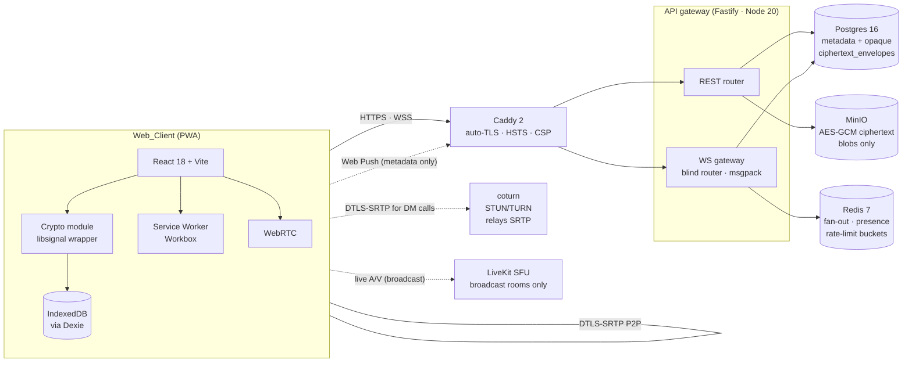
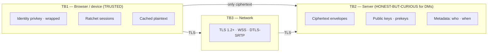
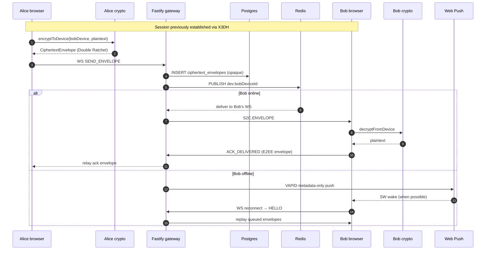
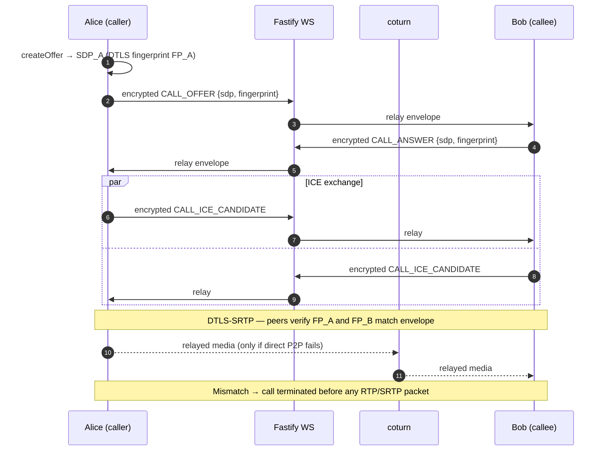
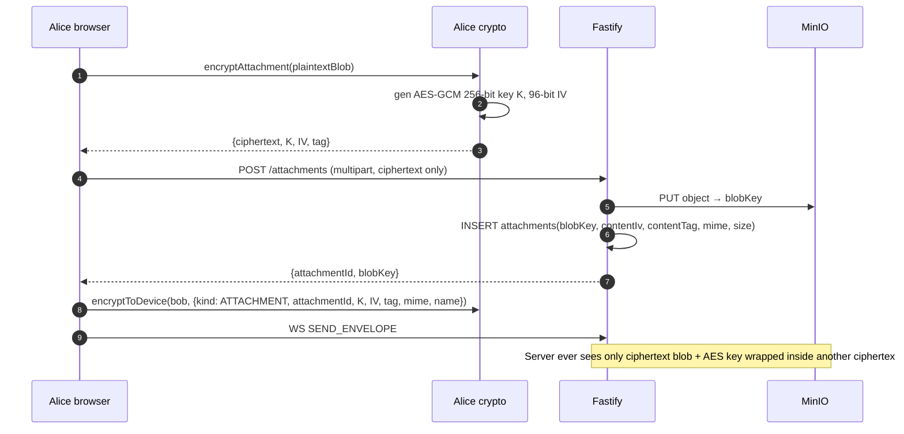
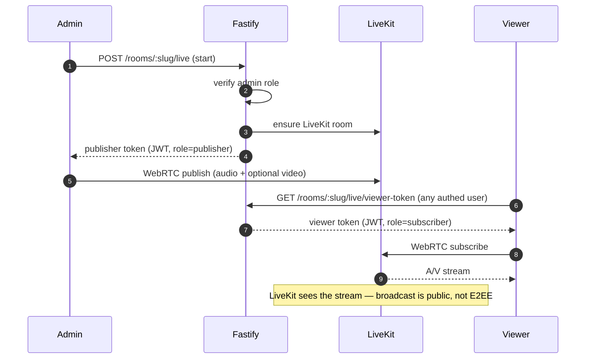

# Architecture

This document describes the runtime topology of Konvo, the trust boundaries
the system operates across, and the data flows that distinguish E2EE direct
messages from public broadcast rooms.

## 1. System overview

Konvo is a self-hosted, web-first PWA. Two distinct conversation modes coexist
on the same backend:

- **End-to-end encrypted 1:1 direct messages** — text, voice notes, file/image
  attachments, audio + video calls. The cryptography is libsignal under the
  hood (X3DH for session establishment, Double Ratchet for per-message
  encryption). The server is engineered as a **blind router**: it persists
  opaque ciphertext envelopes and routes them; it never holds plaintext DM
  content, plaintext attachment bytes, or DM call media.
- **Telegram-style public broadcast rooms** — Ed25519-signed plaintext posts
  with optional live A/V via LiveKit SFU. Authenticity, not confidentiality,
  is the security property here.



Caddy terminates TLS and is the single public entry point. The API gateway
sits behind it. coturn relays encrypted SRTP only; it never decrypts media.
LiveKit is reserved for broadcast rooms — it never carries 1:1 DM media.

## 2. Architectural principles

- **The server is a blind router for DMs.** It persists
  `{recipientDeviceId, ciphertextEnvelope}` rows and fans out via Redis
  pub/sub. It does not decrypt anything.
- **P2P media for 1:1 calls.** Calls go directly browser-to-browser over
  WebRTC, with coturn relaying encrypted SRTP only when NAT traversal fails.
  The SFU (LiveKit) is reserved for broadcast rooms.
- **Per-device sessions.** Each browser is a distinct device with its own
  Curve25519 identity keypair. Multi-device per user is fan-out-at-sender;
  a user may enrol up to 5 devices.
- **Public broadcast is server-authoritative.** Posts are stored as plaintext
  in Postgres but signed by the author's identity key so viewers verify
  authenticity client-side.
- **PWA-first.** The service worker handles offline shell, cached history,
  and Web Push wake-ups. Push payloads carry only
  `{type, senderHandle, conversationId}` — never plaintext or ciphertext.
- **Single homeserver, no federation.** All data lives in one Postgres + one
  Redis + one MinIO behind one Caddy.

## 3. Trust boundaries



The server is treated as **honest-but-curious** for DMs and **untrusted** for
content confidentiality. It is **trusted** for availability, ordering hints,
and broadcast-room state.

The complete attacker-class breakdown lives in
[`security.md`](./security.md).

## 4. Component responsibilities

| Component | Responsibility | Owns |
| --- | --- | --- |
| `apps/web` (Web_Client) | UI, local key storage, encrypt/decrypt, WebRTC | IndexedDB, identity privkey, ratchet state, outbox |
| `apps/api` (API gateway) | Auth, prekey distribution, envelope routing, broadcast moderation, push fan-out | Postgres, Redis, MinIO bucket, JWT signing key, VAPID keys |
| `packages/protocol` | Wire-format contract | Envelope schemas, msgpack codecs, REST DTOs |
| `packages/crypto` | Cryptographic operations | libsignal session/store abstraction, AES-GCM helpers, safety-number computation |
| `coturn` | STUN/TURN for P2P NAT traversal in DM calls | Ephemeral REST credentials (1 h TTL) |
| `LiveKit` | SFU for broadcast rooms only | Room state, publisher/viewer JWTs |
| `Caddy` | TLS termination, reverse proxy | Let's Encrypt certs, HSTS, CSP floor |

The monorepo source tree is documented in
[`code-structure.md`](./code-structure.md).

## 5. Data flows

### 5.1 DM send/receive (E2EE)



### 5.2 1:1 call (E2EE signaling, P2P media)



The DTLS-fingerprint binding is the keystone of the call security argument:
the fingerprint of the local SDP is included in the E2EE-signed offer/answer,
and the peer terminates the call with reason `failed` /
`fingerprint_mismatch` before any RTP/SRTP packet is processed. The
[ICE-candidate confidentiality](./security.md) property forbids any
plaintext candidate from traversing the gateway.

### 5.3 Attachment encrypt + upload



The AES-GCM key never leaves the client in cleartext — it rides inside the
inner E2EE payload of a `CiphertextEnvelope`, never as part of the
multipart upload body.

### 5.4 Broadcast post (signed plaintext)

```mermaid
sequenceDiagram
  autonumber
  participant Adm as Admin browser
  participant ACR as Admin crypto
  participant API as Fastify
  participant PG as Postgres
  participant R as Redis
  participant V as Viewer browser

  Adm->>ACR: signBroadcastPost(body, roomId, createdAtMs)
  ACR-->>Adm: Ed25519 signature
  Adm->>API: POST /rooms/:slug/messages {body, signature, createdAtMs, deviceId}
  API->>API: rate-limit 1/s/admin/room ; ±60s clock check
  API->>PG: INSERT broadcast_messages
  API->>R: PUBLISH room:slug
  R-->>API: fan-out
  API->>V: S2C.ROOM_POST {body, signature, authorIdentityPub, authorHandle}
  V->>V: verifyBroadcastPost (Ed25519)
  V->>V: render with verified badge (or red unverified badge on failure)
```

Broadcast rooms intentionally store plaintext bodies — anyone may read a
public room. Authenticity comes from the Ed25519 signature over
`(body || roomId || createdAtMs)`, which viewers verify client-side
against the author's identity public key surfaced in the fan-out frame.

### 5.5 Broadcast live A/V (LiveKit SFU)



LiveKit is used **exclusively** for broadcast rooms. It never carries 1:1
call media; the gateway rejects any LiveKit token request whose room id
references a DM call.

## 6. State machines

### 6.1 Session establishment (X3DH)

```
Idle
  → FetchingBundle               # encryptToDevice with no session
  → ValidatingSPK                # verify Ed25519 signed-prekey signature
  → CheckingIdentity             # TOFU first-sight or trust check
  → Establishing                 # X3DH derives root key + sending chain
  → Active                       # ready to ratchet
  ↑ AwaitingUserVerify           # entered when peer's identity changed
  ↓ Failed                       # signature invalid, network, or user reject
```

### 6.2 1:1 call signaling

```
Idle ──user clicks call──→ Calling ──CALL_OFFER sent──→ Ringing
Idle ──CALL_OFFER recv──→ IncomingRing
Ringing | IncomingRing ──answer/decline──→ Connecting | Ended
Connecting ──ICE complete + DTLS up + fingerprint match──→ InCall
Connecting ──ICE fail / fingerprint mismatch──→ Ended (failed)
InCall ──hangup / connection lost > 10 s──→ Ended
```

### 6.3 Double Ratchet step

Sending: chain-key advance → DH-ratchet check → emit ciphertext.
Receiving: skip-keys check → DH-ratchet update → derive message key →
AEAD verify → plaintext, with `invalid_message` on tag mismatch.

## 7. What this architecture intentionally does not do

These are design choices, not bugs:

- No native iOS/Android apps.
- No group DMs (>2 participants in a DM context).
- No federation.
- No E2EE for broadcast rooms.
- No payments, marketplace, bots, or ads.
- No email-based account recovery.
- No multi-region or HA deployment.
- No SOC2 / enterprise admin / billing.

Each is acknowledged as out of scope in [`security.md`](./security.md) §5.
