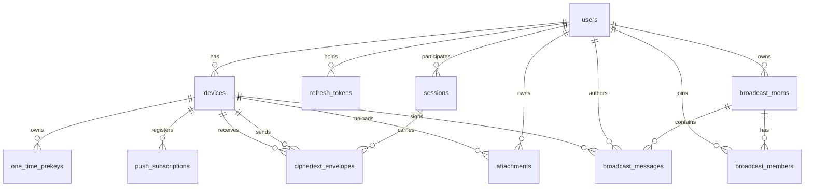
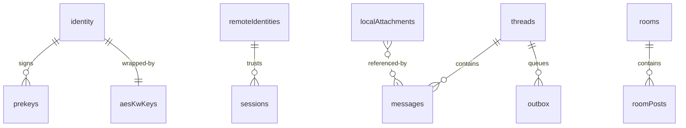

# Data Model

Konvo persists state in three places:

1. **Postgres 16** — durable metadata, opaque ciphertext envelopes, and the
   broadcast room state. Schema source of truth:
   [`infra/postgres/init.sql`](../infra/postgres/init.sql).
2. **MinIO** — AES-GCM ciphertext blobs for attachments. Plaintext is never
   stored here.
3. **IndexedDB (Dexie)** in the browser — the Web_Client's local key
   material, ratchet state, message cache, and outbox.

Postgres values that are intentionally opaque to the server (the
`ciphertext_envelopes.ciphertext` BYTEA column, the
`attachments.{content_iv,content_tag}` columns, broadcast `author_signature`)
are called out below. The redaction layer in
[`apps/api/src/obs/logger.ts`](../apps/api/src/obs/logger.ts) prevents these
fields from leaking into log lines, metric labels, or error responses.

## 1. Postgres schema

The init script is idempotent — every `CREATE` uses `IF NOT EXISTS`, every
`ALTER` uses `ADD COLUMN IF NOT EXISTS`, and the migration runner
([`apps/api/src/db/migrate.ts`](../apps/api/src/db/migrate.ts)) wraps the
whole file in a single transaction. On failure the API refuses to listen.

Extensions enabled at bootstrap: `citext` (case-insensitive handles + room
slugs), `pgcrypto` (`gen_random_uuid()`).

### 1.1 `users`

| Column | Type | Notes |
| --- | --- | --- |
| `id` | UUID PK | `DEFAULT gen_random_uuid()` |
| `handle` | CITEXT UNIQUE | 3–32 chars `[a-z0-9_]` (validated app-side) |
| `password_hash` | TEXT | Argon2id PHC string ; `m=64 MiB, t=3, p=4` |
| `totp_secret` | TEXT NULL | encrypted at rest when present |
| `created_at` | TIMESTAMPTZ | default `now()` |

### 1.2 `refresh_tokens`

| Column | Type | Notes |
| --- | --- | --- |
| `id` | UUID PK | |
| `user_id` | UUID FK → `users(id)` ON DELETE CASCADE | indexed (`refresh_tokens_user_idx`) |
| `token_hash` | BYTEA UNIQUE | sha256 of the opaque 256-bit token + server pepper |
| `issued_at` | TIMESTAMPTZ | default `now()` |
| `expires_at` | TIMESTAMPTZ | 30 days |
| `rotated_at` | TIMESTAMPTZ NULL | set when the token rotates |
| `revoked_at` | TIMESTAMPTZ NULL | set on logout / reuse-detection |

Rotation rule: every successful `POST /auth/refresh` rotates the token.
Re-presenting a rotated/revoked token revokes ALL of the user's active
refresh tokens.

### 1.3 `devices`

| Column | Type | Notes |
| --- | --- | --- |
| `id` | UUID PK | |
| `user_id` | UUID FK → `users(id)` ON DELETE CASCADE | indexed (`devices_user_idx`); cap 5/user enforced app-side |
| `name` | TEXT | 1–64 chars (e.g. "Chrome on MacBook") |
| `identity_pub` | BYTEA | exactly 32 bytes (Curve25519) |
| `identity_ed_pub` | BYTEA NULL | Phase-1 Ed25519 sub-key for SPK / broadcast signature verification |
| `signed_prekey` | JSONB | `{ keyId, publicKey, signature, createdAt }` |
| `registration_id` | INT | 1..16383 |
| `last_seen_at` | TIMESTAMPTZ NULL | bumped on `PRESENCE_PING` |
| `created_at` | TIMESTAMPTZ | default `now()` |

The dual-key (`identity_pub` + `identity_ed_pub`) is a Phase-1 placeholder:
once libsignal/XEdDSA is wired, the Ed25519 key derives from `identity_pub`
on the fly and the column is dropped. See
[`packages/crypto/src/identity.ts`](../packages/crypto/src/identity.ts).

### 1.4 `one_time_prekeys`

| Column | Type | Notes |
| --- | --- | --- |
| `id` | BIGSERIAL PK | |
| `device_id` | UUID FK → `devices(id)` ON DELETE CASCADE | |
| `key_id` | INT | UNIQUE per `(device_id, key_id)` |
| `public_key` | BYTEA | 32 bytes |
| `used` | BOOLEAN | default `FALSE` |

Partial index `prekeys_device_unused_idx ON (device_id) WHERE used = FALSE`
keeps the atomic OPK consumption O(1).

OPK consumption is a single transactional `UPDATE ... SET used=TRUE WHERE id
IN (SELECT ... FOR UPDATE SKIP LOCKED LIMIT 1) RETURNING ...`. Concurrent
prekey-bundle requests cannot receive the same OPK.

### 1.5 `sessions`

DM thread between an unordered pair of users.

| Column | Type | Notes |
| --- | --- | --- |
| `id` | UUID PK | |
| `user_a` | UUID FK → `users(id)` ON DELETE CASCADE | `CHECK (user_a < user_b)` |
| `user_b` | UUID FK → `users(id)` ON DELETE CASCADE | UNIQUE `(user_a, user_b)` |
| `created_at` | TIMESTAMPTZ | default `now()` |

This is the abstract DM thread. The libsignal Double Ratchet "session" state
lives client-side in IndexedDB (`sessions` Dexie table; see §3 below).

### 1.6 `ciphertext_envelopes` (BLIND-ROUTER STORE)

| Column | Type | Notes |
| --- | --- | --- |
| `id` | BIGSERIAL PK | server-assigned monotonic id |
| `session_id` | UUID FK → `sessions(id)` ON DELETE CASCADE | |
| `sender_device` | UUID FK → `devices(id)` ON DELETE CASCADE | |
| `recipient_device` | UUID FK → `devices(id)` ON DELETE CASCADE | |
| `ciphertext` | BYTEA | **OPAQUE.** libsignal-encoded `PreKeySignalMessage` or `SignalMessage`. Never logged. |
| `type` | SMALLINT | `EnvelopeRouterType` (`1=MESSAGE`, `2=ACK`, `3=CALL`) |
| `created_at` | TIMESTAMPTZ | default `now()` |
| `delivered_at` | TIMESTAMPTZ NULL | set on E2EE `ACK_DELIVERED` |
| `read_at` | TIMESTAMPTZ NULL | set on E2EE `ACK_READ` |
| `client_nonce` | TEXT NULL | idempotency key for SEND_ENVELOPE retries |

Indexes:

- `env_recipient_undelivered_idx ON (recipient_device, created_at) WHERE
  delivered_at IS NULL` — keeps offline-replay scans O(unread tail).
- `env_sender_nonce_uniq` UNIQUE on `(sender_device, client_nonce)` — the
  database (not the application) is authoritative for SEND_ENVELOPE
  deduplication. Postgres NULLS-DISTINCT semantics keep legacy rows valid.

`ciphertext` is the canonical opaque field. The redaction layer
([`obs/logger.ts`](../apps/api/src/obs/logger.ts)) recursively strips this
key from every log record.

### 1.7 `attachments`

| Column | Type | Notes |
| --- | --- | --- |
| `id` | UUID PK | |
| `owner_user` | UUID FK → `users(id)` ON DELETE CASCADE | uploader |
| `owner_device_id` | UUID FK → `devices(id)` ON DELETE SET NULL | uploading device (audit correlation) |
| `allowed_recipient_user_ids` | UUID[] | uploader-declared ACL ; `GET /attachments/:id` accepts owner OR any user in this array |
| `blob_key` | TEXT | MinIO object key |
| `content_iv` | BYTEA | 96-bit AES-GCM IV (opaque) |
| `content_tag` | BYTEA | 128-bit AES-GCM authentication tag (opaque) |
| `size_bytes` | BIGINT | ciphertext length |
| `mime` | TEXT | ≤255 chars |
| `created_at` | TIMESTAMPTZ | default `now()` |

The AES-GCM **key** is NOT stored here. It rides inside an E2EE
`InnerType.ATTACHMENT` / `VOICE_NOTE` payload as part of an
`AttachmentRef`, never seen by the server in cleartext.

### 1.8 `broadcast_rooms`

| Column | Type | Notes |
| --- | --- | --- |
| `id` | UUID PK | |
| `slug` | CITEXT UNIQUE | 3–64 chars `[a-z0-9-]` |
| `name` | TEXT | 1–100 chars |
| `description` | TEXT NULL | |
| `owner_user` | UUID FK → `users(id)` ON DELETE CASCADE | becomes admin via `broadcast_members` |
| `created_at` | TIMESTAMPTZ | default `now()` |

### 1.9 `broadcast_members`

Composite-PK join table.

| Column | Type | Notes |
| --- | --- | --- |
| `room_id` | UUID FK → `broadcast_rooms(id)` ON DELETE CASCADE | PK part 1 |
| `user_id` | UUID FK → `users(id)` ON DELETE CASCADE | PK part 2 |
| `role` | TEXT | `CHECK (role IN ('admin', 'subscriber'))` |

Server-authoritative role check: `POST /rooms/:slug/messages` returns 403
unless the caller has `role='admin'`.

### 1.10 `broadcast_messages`

| Column | Type | Notes |
| --- | --- | --- |
| `id` | BIGSERIAL PK | |
| `room_id` | UUID FK → `broadcast_rooms(id)` ON DELETE CASCADE | |
| `author_user` | UUID FK → `users(id)` ON DELETE CASCADE | |
| `author_device` | UUID FK → `devices(id)` ON DELETE CASCADE NULL | which device's Ed25519 sub-key signed the post |
| `body` | TEXT | ≤4 KiB ; rate-limited 1/s/admin/room |
| `author_signature` | BYTEA | 64-byte Ed25519 over `(body || roomId || createdAtMs)` |
| `created_at` | TIMESTAMPTZ | default `now()` |

Index: `bmsg_room_created_idx ON (room_id, created_at DESC)` for paginated
history (`GET /rooms/:slug/messages?before=...&limit=50`).

Posts are intentionally plaintext — broadcast rooms are public by design.
Authenticity is enforced client-side via `verifyBroadcastPost` against
`author_identity_pub`.

### 1.11 `push_subscriptions`

| Column | Type | Notes |
| --- | --- | --- |
| `id` | UUID PK | |
| `device_id` | UUID FK → `devices(id)` ON DELETE CASCADE | |
| `endpoint` | TEXT | MUST be HTTPS (validated app-side) |
| `p256dh` | TEXT | Web Push public key |
| `auth` | TEXT | Web Push auth secret |
| `created_at` | TIMESTAMPTZ | default `now()` |

VAPID push payloads carry only `{type, senderHandle, conversationId}` —
never plaintext or ciphertext.

### 1.12 Validation rules (enforced app-side)

| Field | Rule |
| --- | --- |
| `users.handle` | 3–32 lowercase chars `[a-z0-9_]` (CITEXT in DB) |
| `devices.identity_pub` | exactly 32 bytes (Curve25519) |
| `one_time_prekeys` | replenish trigger when `count(used=false) < 20` per device |
| `ciphertext_envelopes.ciphertext` | ≤64 KiB (text + AES key wrap); attachments live in MinIO |
| `broadcast_messages.body` | ≤4 KiB ; rate-limited 1/s/admin/room |
| `broadcast_messages.created_at` | ±60 s of API gateway clock at insert time |
| `attachments` | per-blob ciphertext ≤25 MiB ; `mime` ≤255 chars |
| `push_subscriptions.endpoint` | scheme MUST be `https://` |
| `LiveKit` | broadcast rooms only ; refused for any DM call id |

### 1.13 Retention

The MVP keeps all rows indefinitely. Operators can introduce TTL via
periodic jobs (e.g. delete `ciphertext_envelopes` older than N days where
`delivered_at IS NOT NULL`) without affecting correctness — the libsignal
session does not depend on server-side history once a message has been
delivered.

## 2. MinIO bucket

| Object | Lifetime | Notes |
| --- | --- | --- |
| `konvo-attachments/<blob_key>` | indefinite | AES-GCM ciphertext only ; bucket is private ; no presigned URLs |

Access control: `GET /attachments/:id` enforces
`caller.userId === attachments.owner_user OR caller.userId IN attachments.allowed_recipient_user_ids`,
returning 403 otherwise.

## 3. Dexie / IndexedDB schema (`apps/web`)

Schema source of truth:
[`apps/web/src/db/schema.ts`](../apps/web/src/db/schema.ts). Tables are
versioned via Dexie's `version(N).stores({...})` chain; existing rows are
preserved across version bumps.

| Table | Primary key | Purpose |
| --- | --- | --- |
| `identity` | `'me'` | single-row : wrapped X25519 identity privkey + Phase-1 Ed25519 sub-key + registration id |
| `prekeys` | `++id` | signed prekey + one-time prekeys (compound `[keyType+used]` index) |
| `aesKwKeys` | `'me'` | non-extractable WebCrypto AES-KW KEK that wraps every privkey at rest |
| `remoteIdentities` | `${peerUserId}:${peerDeviceId}` | TOFU bookkeeping ; `trusted` flag ; `lastChangedAt` |
| `sessions` | `${peerUserId}:${peerDeviceId}` | Double Ratchet state per peer device |
| `threads` | `peerUserId` | DM thread mirror : last message, unread count, peer handle |
| `messages` | `++id` | per-thread message log (states: `sending`/`delivered`/`read`/`failed`/`tampered`) ; UNIQUE `clientNonce` |
| `outbox` | `++id` | pending-send FIFO queue ; UNIQUE `clientNonce` ; replay on reconnect |
| `rooms` | `slug` | local mirror of broadcast rooms ; `roomId` (UUID) carried for signature verification |
| `roomPosts` | `${roomSlug}:${postId}` | local mirror of signed broadcast posts ; `verified` flag |
| `localAttachments` | `++id` | bounded LRU cache (200 MiB cap) of downloaded ciphertext + decrypted plaintext |

Notable invariants (see header comments in
[`schema.ts`](../apps/web/src/db/schema.ts) for the full rationale):

- Boolean fields that participate in compound indices are encoded as
  numeric `0|1` flags (IndexedDB rejects boolean keys). Repositories
  convert at the public API surface.
- `identity` stores only **wrapped** key bytes. The KEK lives in a separate
  `aesKwKeys` row as a non-extractable `CryptoKey` (preserved across
  reload by IndexedDB structured-clone).
- `outbox` is keyed by an auto-`id` so FIFO replay is just primary-key ASC.
  The 7-day age sweep uses the `enqueuedAt` index.
- `localAttachments.ciphertext` is the canonical cached payload —
  `plaintext` is recomputed on demand from the AES-GCM key inside the
  envelope. Storing only ciphertext means a stolen device can't read the
  attachment without the corresponding ratchet state.

## 4. Where this data is and is not allowed

| Plaintext data | Stored in Postgres? | Stored in MinIO? | Stored in IndexedDB? |
| --- | --- | --- | --- |
| DM message body | NEVER | NEVER | yes (sender + recipient device) |
| DM attachment bytes | NEVER | NEVER (ciphertext only) | yes (LRU cache) |
| DM call media | NEVER | NEVER | NEVER (DTLS-SRTP P2P) |
| Broadcast post body | yes (intentional) | n/a | yes (mirror) |
| User handle | yes | n/a | yes |
| Public keys | yes | n/a | yes |
| Identity privkey | NEVER | NEVER | yes (AES-KW wrapped) |
| Ratchet state | NEVER | NEVER | yes |
| Refresh token (raw) | NEVER (only `sha256(token + pepper)`) | NEVER | NEVER (httpOnly cookie carries it) |
| Access token | NEVER | NEVER | NEVER (in-memory only) |
