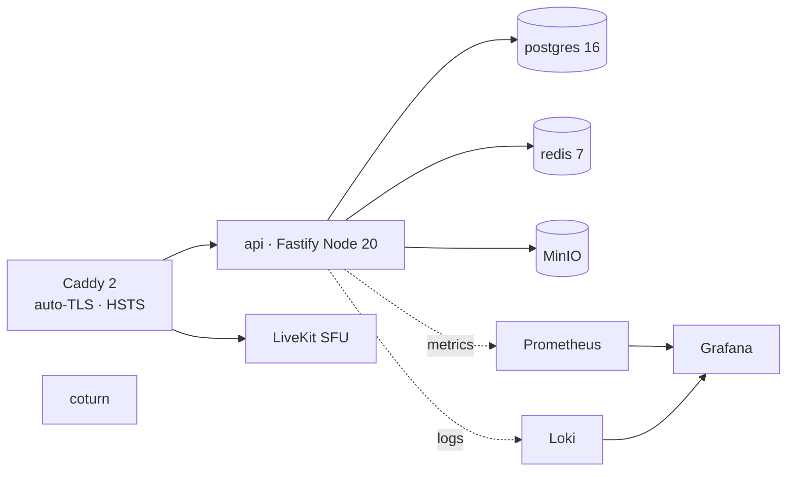

# Deployment

Konvo runs as a single-host docker-compose stack ; the entire data plane plus
observability comes up with one command. Sources of truth:
[`infra/docker-compose.yml`](../infra/docker-compose.yml) and
[`apps/api/.env.example`](../apps/api/.env.example).

## 1. Stack overview



Every service exposes a healthcheck with `interval: 5s × retries: 24 = 120 s`.

## 2. Prerequisites

- Linux host (or macOS for local dev).
- Docker with the Compose plugin (Compose v2).
- Free ports on the host: `80`, `443`, `3478/udp`, `5349/udp`, `7880`–`7882`,
  `49152`–`49200/udp` (TURN relay range).
- DNS pointing your chosen hostname at the host (Caddy obtains a Let's
  Encrypt cert at first boot in production ; local dev uses `konvo.local`
  over HTTPS via Caddy's internal CA).

## 3. Bring it up

```bash
git clone https://github.com/<your-org>/KonvoPro.git
cd KonvoPro

# Configure API secrets. Replace every line flagged "REGENERATE FOR PRODUCTION".
cp apps/api/.env.example apps/api/.env
$EDITOR apps/api/.env

# Start the stack.
docker compose -f infra/docker-compose.yml up -d
```

The api service applies migrations automatically at first boot via
[`apps/api/src/db/migrate.ts`](../apps/api/src/db/migrate.ts) — the init
script runs inside a single transaction and the API refuses to listen on
failure.

To shut everything down without losing volumes:

```bash
docker compose -f infra/docker-compose.yml down
```

To wipe the data plane (destructive — loses all DB rows, MinIO blobs, push
subscriptions, Grafana dashboards, Caddy certs):

```bash
docker compose -f infra/docker-compose.yml down -v
```

## 4. Environment variables

Every variable below is parsed by
[`apps/api/src/config.ts`](../apps/api/src/config.ts) at boot. Missing or
empty values cause the process to exit with status 1 BEFORE the listener
opens. Lines flagged "REGENERATE FOR PRODUCTION" must NEVER be committed.

### 4.1 Runtime

| Var | Default | Notes |
| --- | --- | --- |
| `NODE_ENV` | `development` | `production` enforces `sslmode=require` on `DATABASE_URL` |
| `PORT` | `3000` | Caddy proxies to this port |

### 4.2 Auth

| Var | Notes |
| --- | --- |
| `JWT_ACCESS_SECRET` | HS256 secret, ≥32 chars high-entropy ; `openssl rand -base64 48` |
| `REFRESH_TOKEN_PEPPER` | sha256 pepper for refresh-token storage, ≥32 chars |
| `ARGON2_M_KIB` / `ARGON2_T` / `ARGON2_P` | defaults `65536` / `3` / `4` ; verify benchmark must complete ≥ 250 ms |

### 4.3 Data plane

| Var | Notes |
| --- | --- |
| `DATABASE_URL` | `postgres://user:pw@host:5432/konvo[?sslmode=require]` ; production MUST include `sslmode=require` |
| `REDIS_URL` | `redis://...` or `rediss://...` for TLS |
| `MINIO_ENDPOINT` | `host:port` (no scheme) |
| `MINIO_ACCESS_KEY` / `MINIO_SECRET_KEY` | regenerate per environment |
| `MINIO_BUCKET` | bucket name for E2EE attachment blobs |
| `MINIO_USE_SSL` | `true` in production |

### 4.4 Real-time media

| Var | Notes |
| --- | --- |
| `COTURN_REST_SECRET` | shared secret for coturn REST-auth ; ≥32 chars |
| `COTURN_REALM` | matches your public hostname |
| `LIVEKIT_API_KEY` / `LIVEKIT_API_SECRET` | LiveKit JWT signing pair (broadcast rooms only) |
| `LIVEKIT_URL` | `ws://livekit:7880` in dev, `wss://...` in prod |

### 4.5 Web Push (VAPID)

| Var | Notes |
| --- | --- |
| `VAPID_PUBLIC_KEY` / `VAPID_PRIVATE_KEY` | generate via `npx web-push generate-vapid-keys` |
| `VAPID_SUBJECT` | `mailto:` URI or `https://` URL identifying the operator |

The full annotated template lives in
[`apps/api/.env.example`](../apps/api/.env.example).

## 5. TLS and reverse proxy

[`infra/caddy/Caddyfile`](../infra/caddy/Caddyfile) terminates TLS, redirects
HTTP→HTTPS, and emits the security headers that act as a floor when the api
service is bypassed:

- HSTS `max-age=63072000; includeSubDomains; preload`.
- `X-Frame-Options: DENY`, `X-Content-Type-Options: nosniff`,
  `Referrer-Policy: strict-origin-when-cross-origin`,
  `Permissions-Policy: ...`.
- Refuses `ws://` upgrades.

The api service additionally emits a strict CSP via `@fastify/helmet`
([`apps/api/src/server.ts`](../apps/api/src/server.ts)):

```
default-src 'self';
script-src 'self' 'wasm-unsafe-eval';
style-src 'self' 'nonce-<per-request>';
img-src 'self' data: blob:;
media-src 'self' blob: wss:;
connect-src 'self' wss: turns:;
frame-ancestors 'none';
```

## 6. Backup and restore

The two stateful volumes are `postgres_data` and `minio_data`. Logical
backup is sufficient for both ; binary snapshots work too if the operator
prefers.

```bash
# Postgres logical dump.
docker exec konvo-postgres-1 \
  pg_dump -U konvo -d konvo --format=custom > konvo-pg-$(date +%F).dump

# Postgres restore (against a fresh volume).
docker exec -i konvo-postgres-1 \
  pg_restore -U konvo -d konvo --clean --if-exists < konvo-pg-2026-05-25.dump

# MinIO mirror via mc (install: https://min.io/docs/minio/linux/reference/minio-mc.html)
mc alias set konvo http://localhost:9000 $MINIO_ACCESS_KEY $MINIO_SECRET_KEY
mc mirror konvo/konvo-attachments ./konvo-blobs/
mc mirror ./konvo-blobs/ konvo/konvo-attachments    # to restore
```

Backups MUST be encrypted at rest with a key the operator controls. The
ciphertext blobs in MinIO are already AES-GCM encrypted by the client, but
the Postgres dump contains metadata (handles, timing, signed broadcast
posts in plaintext) that you almost certainly don't want public.

Refresh tokens, VAPID keys, JWT signing keys, and coturn / LiveKit shared
secrets MUST be backed up out of band — losing the JWT secret invalidates
every issued access token and forces users to re-login but is otherwise
recoverable ; losing the VAPID private key invalidates every existing push
subscription and the SW must re-subscribe.

## 7. Observability

Prometheus scrapes `api:9090/metrics` (the API gateway exposes the
exposition-format endpoint ; see
[`apps/api/src/obs/metrics.ts`](../apps/api/src/obs/metrics.ts)).

### 7.1 Metrics inventory

The current metric set, all bounded-cardinality (cap 100 distinct
label-combinations per metric) :

| Metric | Type | Labels | Purpose |
| --- | --- | --- | --- |
| `konvo_ws_connections` | Gauge | — | active authenticated WSS connections |
| `konvo_envelopes_routed_total` | Counter | `routerType` (`msg`/`ack`/`call`) | DM routing throughput |
| `konvo_envelope_store_seconds` | Histogram | — | persist + Redis publish latency |
| `konvo_envelope_offline_queued_total` | Counter | — | offline-fallback path |
| `konvo_push_send_total` | Counter | `outcome` (`success`/`gone_410`/`error`) | Web Push deliveries |
| `konvo_turn_bytes_total` | Counter | — | coturn relay bandwidth |
| `konvo_livekit_rooms_active` | Gauge | — | active broadcast rooms |
| `konvo_livekit_viewers` | Gauge | — | aggregate broadcast viewers |
| `konvo_auth_attempts_total` | Counter | `outcome` (`success`/`invalid_credentials`/`rate_limited`) | login/signup health |
| `konvo_argon2_verify_seconds` | Histogram | — | password-verify cost (alert if `< 0.25 s`) |
| `konvo_rate_limited_total` | Counter | — | rate-limit hits |
| `konvo_log_redaction_failures_total` | Counter | — | dropped log records |
| `konvo_label_cardinality_drops_total` | Counter | `metric` | safety-cap drops (one row per metric that hits the cap) |

### 7.2 Grafana dashboards

The four dashboards under
[`infra/grafana/dashboards/`](../infra/grafana/dashboards/) (provisioned at
first boot) :

- **DM Health** — envelope rate, p50/p95/p99 store latency, offline queue
  depth, push success rate.
- **Calls** — TURN bandwidth, LiveKit viewer count, room count.
- **Auth** — signups/min, failed logins/min, refresh rate.
- **System** — API CPU/mem, Postgres connections, Redis ops/sec.

### 7.3 Logs

Fastify's pino emits JSON one event per line. The redaction layer in
[`obs/logger.ts`](../apps/api/src/obs/logger.ts) recursively strips the
forbidden fields BEFORE write : `ciphertext`, `body`, `password`, `token`,
`key`, `privateKey`, `identityPriv`, `secret`, `argon2Hash`. Loki ingests
the stream ; Grafana renders it.

## 8. Operational checklist

Before a production deploy:

- [ ] Every `REGENERATE FOR PRODUCTION` value in
      [`apps/api/.env.example`](../apps/api/.env.example) replaced with a
      fresh high-entropy secret per environment.
- [ ] `DATABASE_URL` includes `sslmode=require`.
- [ ] `MINIO_USE_SSL=true`.
- [ ] Caddy hostname resolves and Let's Encrypt issuance succeeds at first
      boot.
- [ ] coturn ports `3478/udp`, `5349/udp`, and the relay range
      (`49152`–`49200/udp` by default) reachable from the public Internet.
- [ ] Backup automation in place for `postgres_data` and `minio_data`.
- [ ] Monitoring alerts on `konvo_argon2_verify_seconds < 0.25 s` and
      `konvo_log_redaction_failures_total > 0`.
- [ ] Threat-model acceptances reviewed with the team
      ([`security.md` §4](./security.md)).
